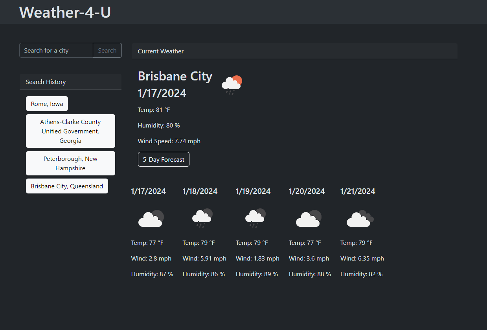
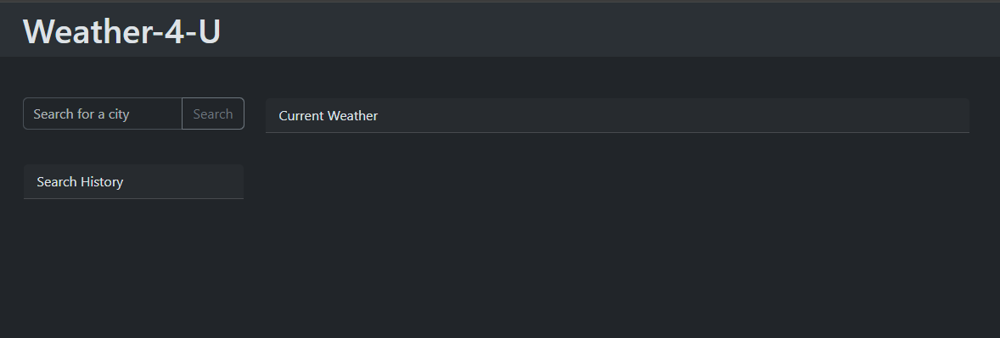
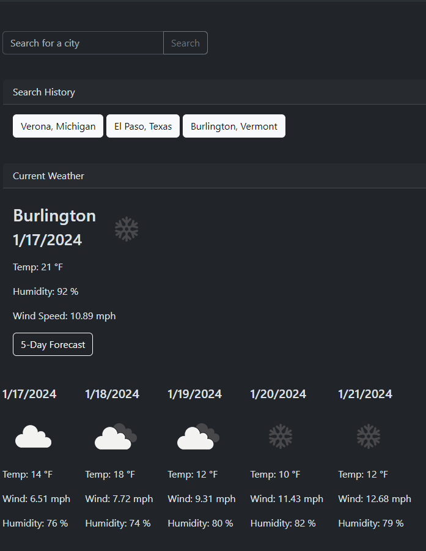

# WEATHER-4-U

## Description
This weather app allows users to search for any location and display the current weather conditions at that location, as well as a five-day forecast.

The app is responsive, and allows users to choose between multiple cities with the same name.

The impetus for building this app is to provide a quick and easy way to look up weather conditions for the user's convenience. 

This project allowed me to work on making repeated API 'get' requests, parsing response data, and using the returned data to make further API 'get' requests.
It also afforded me the opportunity to practice filtering data, ensuring that state is kept current, and practicing jQuery for DOM manipulation.

## Installation
None required- this app may be run in the browser from its deployment on Github Pages (see below).

## Usage
The user can follow a simple and intuitive UI to search for a city using a single text input and button. Subsequent buttons will appear and guide the user's interaction.

## Deployment
Deployed on Github Pages: 
### https://ag-bootcamp-umn.github.io/weather4u/

## Screenshots
### The app in use

### Simple UI

### Responsive Layout

## License

MIT License

Copyright (c) 2024 Alex Geer

Permission is hereby granted, free of charge, to any person obtaining a copy
of this software and associated documentation files (the "Software"), to deal
in the Software without restriction, including without limitation the rights
to use, copy, modify, merge, publish, distribute, sublicense, and/or sell
copies of the Software, and to permit persons to whom the Software is
furnished to do so, subject to the following conditions:

The above copyright notice and this permission notice shall be included in all
copies or substantial portions of the Software.

THE SOFTWARE IS PROVIDED "AS IS", WITHOUT WARRANTY OF ANY KIND, EXPRESS OR
IMPLIED, INCLUDING BUT NOT LIMITED TO THE WARRANTIES OF MERCHANTABILITY,
FITNESS FOR A PARTICULAR PURPOSE AND NONINFRINGEMENT. IN NO EVENT SHALL THE
AUTHORS OR COPYRIGHT HOLDERS BE LIABLE FOR ANY CLAIM, DAMAGES OR OTHER
LIABILITY, WHETHER IN AN ACTION OF CONTRACT, TORT OR OTHERWISE, ARISING FROM,
OUT OF OR IN CONNECTION WITH THE SOFTWARE OR THE USE OR OTHER DEALINGS IN THE
SOFTWARE.